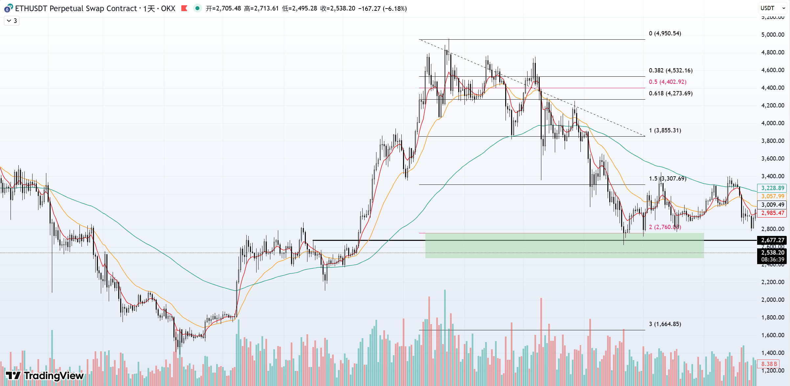

## 一个投机者的反思：我为什么开始长期投资ETH？

> *曾经沧海难为水，除却巫山不是云。*
>
> *—— 元稹《离思五首·其四》*

2025年毕业后在一家小公司做Golang后端开发。某天摸鱼的时候，我在一个技术群里看到有人讨论加密货币。因为我自己一直在币圈做投机交易，就顺手点开看了看。

群里一位前辈的经历让我印象深刻，他23年毕业前，便把身上2w人民币梭哈了比特币现货（（时价约2万美元）。我闻之慨叹，不禁汗颜。回想同年，我手握5000元奖学金，亦曾预感牛市将至，却因畏首畏尾，四处求问而不得其法，最终那笔钱变成了兜里的iPhone 15 Pro，与一轮`特朗普`牛市失之交臂。

前辈坦言，他经历了长达近两年的浮亏，但工作了后依旧坚持定投BTC，每次发工资身上除了生活费的其他的资产全投资成了BTC。他的劝诫言犹在耳：“普通人莫玩合约，定投大饼，足矣。”

我觉得他说的好有道理啊，我们仰望的KOL其实已经是这个市场的佼佼者了，一将功成万骨枯。自己时常复盘，如果23年有他那份果决，并且一直持有的话，会有最少5倍的收益。一次次怕高，换来一次次踏空，最后看着BTC突破10w美元。
`怕高都是苦命人呐！`

牛熊转折点发生在2025年10月11日早上5点左右，币圈市场遭遇了大规模的保证金仓位清算，交易者在24小时内损失超过**190亿**美元。稳定币**USDE**脱锚，山寨币哀鸿遍野，跌幅触目惊心高达**90%**。早上睡醒后我看着瀑布般的K线，开始思考自己未来的计划。投机之路的风险与脆弱暴露无遗，我意识到币圈可能要迎来一波大的调整。短线的狂欢终是过眼云烟，唯有静待花开，择时而入，方为智者所为。

---

## 我选择的破局之路：恐慌市场中落下第一子

> *莫等闲，白了少年头，空悲切。*
>
> *—— 岳飞《满江红》*

在K线图上，我用绿色标记出2500至2760美元的区域，这是自己觉得左侧介入现货的绝佳点位，遂在2680美元左侧挂单 :spoiler[4000]人民币。

**落子无悔！**

这时，一个抉择摆在面前：是博一个反弹就走的短线客，还是就此开启一段价值长持的旅程？

我选择后者，虽然BTC已经经历几轮牛市，但是我认为区块链这个行业任然处于早期阶段，其价值远未被完全释放，ETH的价格相较于它的潜力，不过是冰山一角。

> [!TIP] 基本美好，早晚得势
> 最好的投资时机，一个是十年之前，另一个就是现在。

---

## 与AI共筑：我的ETH金字塔投资模型

> *运筹帷幄之中，决胜千里之外。*
>
> *——《史记·高祖本纪》*

决心已下，但长持之路并非仅有热情便能走完。那么我有什么计划呢？

一套清晰、理性的投资计划便不可或缺。我觉得BTC底部大概在7.4w美元左右，但是ETH作为山寨头子，我完全猜不到其底部到底会落在哪儿，害怕自己受情绪影响影响，所以决定求助AI。

在众多AI模型中，我将目光投向了幻方量化旗下的DeepSeek。因为幻方本身就是国内量化投资领域的佼佼者。由这样的机构训练出的模型，在数据分析和策略制定上，可以说是根正苗红的"科班选手”，其专业性与权威性正是我所需要的。刚毕业半年身上资金不多，我将1万元的补仓预算与1400-2500美元的心理区间交给了它，让deepseek给了一个高粒度的加仓方案。方案如下：

| 档位 | 目标价  (USD) | 加仓金额  (CNY) | 预计购入  ETH | 累计投入  (CNY) | 累计  ETH | 实时平均成本  (USD) |
|:--:|:---------------:|:----------------:|:--------------:|:----------------:|:------------:|:------------------:|
| 初始 |      2680       |      4,000       |     0.2132     |      4,000       |    0.2132    |        2680        |
| 1  |      2500       |       600        |     0.0343     |      4,600       |    0.2475    |       ≈2560        |
| 2  |      2367       |       700        |     0.0422     |      5,300       |    0.2897    |       ≈2440        |
| 3  |      2234       |       800        |     0.0512     |      6,100       |    0.3409    |       ≈2325        |
| 4  |      2101       |       900        |     0.0612     |      7,000       |    0.4021    |       ≈2195        |
| 5  |      1968       |      1,000       |     0.0726     |      8,000       |    0.4747    |       ≈2080        |
| 6  |      1835       |      1,200       |     0.0934     |      9,200       |    0.5681    |       ≈1980        |
| 7  |      1702       |      1,400       |     0.1175     |      10,600      |    0.6856    |       ≈1885        |
| 8  |      1569       |      1,600       |     0.1457     |      12,200      |    0.8313    |       ≈1795        |
| 9  |      1436       |      1,300       |     0.1293     |      13,500      |    0.9606    |       ≈1725        |
| 10 |      1400       |       500        |     0.0510     |      14,000      |    1.0116    |       ≈1695        |

我认为AI给出的金字塔式的加仓结构科学且稳健。遂以此为律，静待时机！

---

## 千里之行：我的当前进度与展望

> *路漫漫其修远兮，吾将上下而求索。*
>
> *—— 屈原《离骚》*

目前，我的长持之旅刚刚启程。

- [x] 初始阶段 补仓价位: 2680美元 时间：`2025-11-21 15:34:10`
- [x] 1阶段 补仓价位: 2500美元 时间：`2026-02-01 00:47:43`
- [ ] 2阶段 补仓价位: 2367美元
- [ ] 3阶段 补仓价位: 2234美元
- [ ] 4阶段 补仓价位: 2101美元
- [ ] 5阶段 补仓价位: 1968美元
- [ ] 6阶段 补仓价位: 1835美元
- [ ] 7阶段 补仓价位: 1702美元
- [ ] 8阶段 补仓价位: 1569美元
- [ ] 9阶段 补仓价位: 1436美元
- [ ] 10阶段 补仓价位: 1400美元
